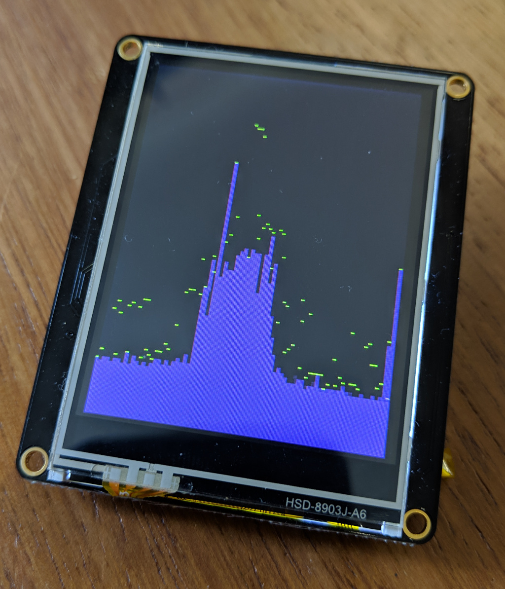

# nRF Scanner

This is a 2.4GHz RSSI scanner based on the [nRF Connect](https://github.com/NordicSemiconductor/pc-nrfconnect-core) example [RSSI Viewer](https://github.com/NordicSemiconductor/pc-nrfconnect-rssi), but designed to use an [
Adafruit Feather nRF52 Bluefruit LE - nRF52832](https://www.adafruit.com/product/3406) with a [TFT FeatherWing](https://www.adafruit.com/product/3315) to create a portable, self contained scanner.

